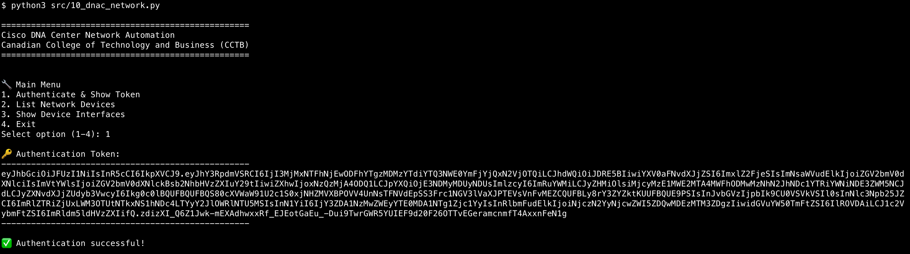
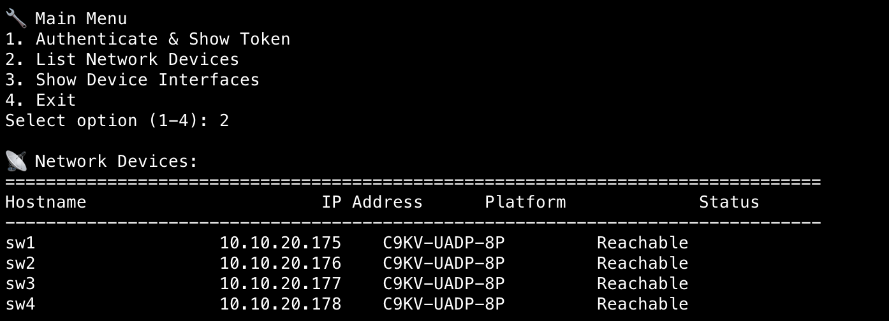
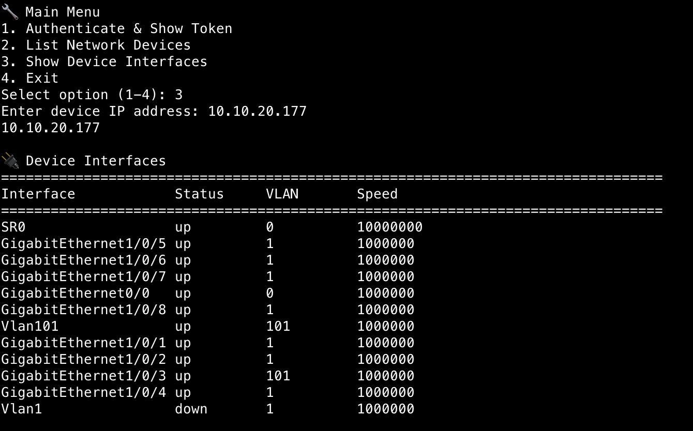

# IST105 Assignment#10
This is the repository for IST105 assignment#9

## Develop local
```shell
$ python3 -m venv .venv
$ source .venv/bin/activate
$ python3 -m pip install -r requirements.txt
$ python3 src/10_dnac_network.py
```

## Screenshots



